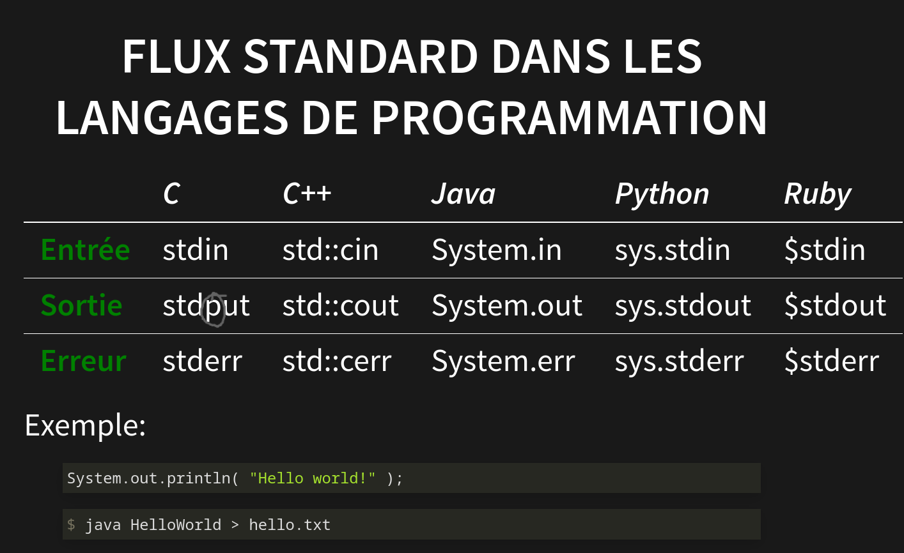
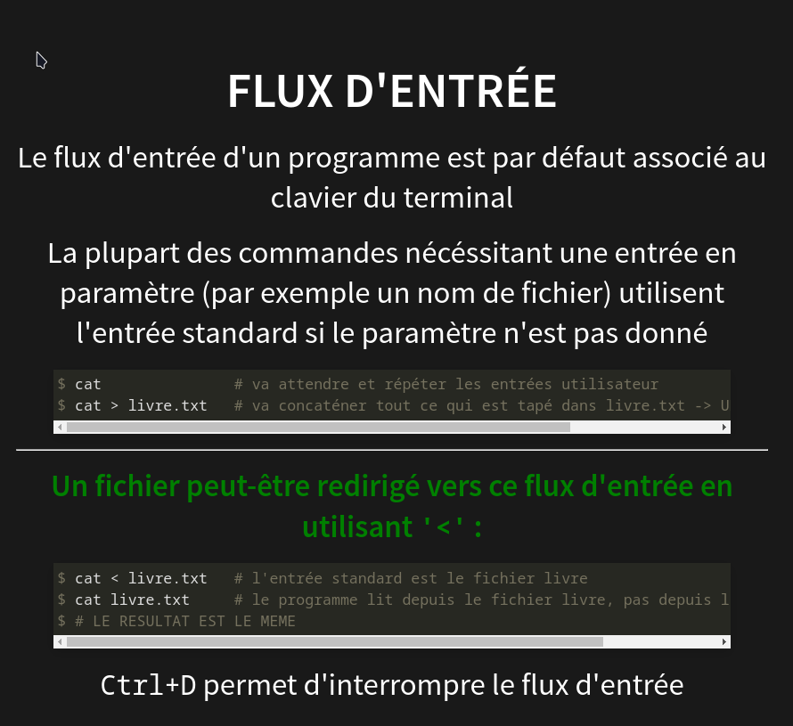
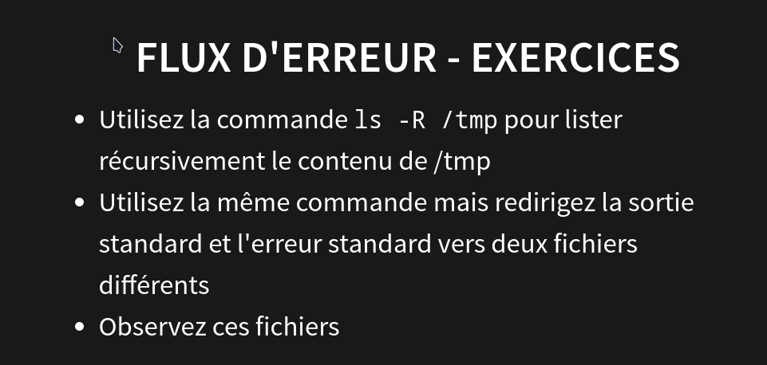
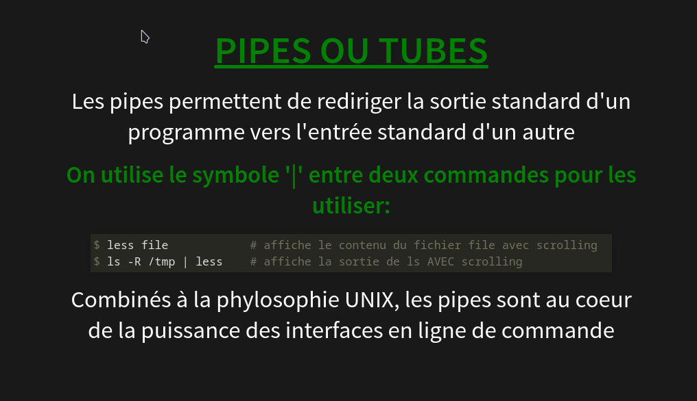
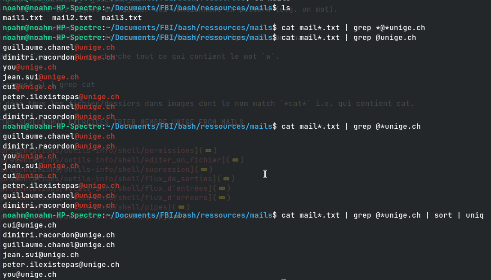

# 1. Cours 01 : SHELL & BASH Scripting #


<!-- ===== -->
- [1. Cours 01 : SHELL & BASH Scripting](#1-cours-01--shell--bash-scripting)
	- [1.1. ls arguments](#11-ls-arguments)
	- [1.2. Permissions [^9]](#12-permissions-9)
	- [1.3. Removal [^4]](#13-removal-4)
	- [1.4. Text Editors [^3]](#14-text-editors-3)
	- [1.5. I/O Streams](#15-io-streams)
		- [1.5.1. Ouput stream [^2]](#151-ouput-stream-2)
		- [1.5.2. Input Stream [^5]](#152-input-stream-5)
		- [1.5.3. Error Stream [^6]](#153-error-stream-6)
	- [1.6. Pipes & Tubes [^7]](#16-pipes--tubes-7)
	- [1.7. GREP [^8]](#17-grep-8)
			- [1.7.0.1. Exo récuperer liste unique et triée de mails depuis plusieurs fichiers](#1701-exo-récuperer-liste-unique-et-triée-de-mails-depuis-plusieurs-fichiers)
	- [1.8. Tips](#18-tips)
## 1.1. ls arguments ##

    ls cat9?.*

`?` est utilisé pour remplacer 1 char, `cat9?` => Wildcard pour un seul char 
=> match tous les files de la forme 
	

	cat9 · c 
(où `'c'`  est un seul charactère)

	cat $file1, $file2... 
<small> // prints concatenated content of all files passed as argument</small>

`/etc` contains all configurations files

----

## 1.2. Permissions [^9] ##

`drwxr-xr--` `==>` `d | rwx | r-x | r - -`

*  d => _**d**irectory_
*  r => _**r**ead     = **4**_  
*  w => _**w**rite    = **2**_
*  x => _e**x**ecute  = **1**_


| FileType | User    | Group   | Other   |
|----------|---------|---------|---------|
| `d - `   | `r w x` | `r - x` | `- - -` |
|          | 4 2 1   | 4 0 1   | 0 0 0   |
|          | 7       | 5       | 0       |

_each "tag" is controled/modifed/interpreted as a group of 3 octal value_
<h4> exemple: </h4>

 Here we have `750` (i.e. `chmod 750 $file` doesn't change anything )

---


<h3> Exo modifier droits </h3>

```ls -l bird00.jpg``` &nbsp; &nbsp; <small> // prints: `-rwxrw-r--` </small>  


 <br> `chmod 364 bird00.jpg`  (3 = 2:write + 1:execute ) (6: 4:read + 2:write) (4:read)  

`ls -l bird00.jpg`   &nbsp;&nbsp; &nbsp; <small> // prints: `--wxrw-r--  ` </small>  

`cat bird00.jpg` 	&nbsp;&nbsp; &nbsp; <small> // prints: `cat: bird00.jpg: Permission denied` </small>

_Ou plus Simplement:_  
	
	chmod u±(r,w,x)  

`u±(X_1, X_2, ..., X_n)`  `<==>` Add / remove Permission X1 or ... Xn to user  

	chmod a±(r, w, x)

`u±(X_1, X_2, ..., X_n)` `<==>` Add / remove Permission X1 or ... Xn to all	

Copy try:  

    cp images/bird00.jpg backup/mybird.jpg  
	cp: cannot open 'images/bird00.jpg' for reading: Permission denied  

Cannot Copy because don't have read/write permission

--- git clone https://gitlab.unige.ch/outils-info/bash.git

Test of Github colored code block:

```python
import random

class CardGame(object):
    """ a sample python class """
    NB_CARDS = 32
    def __init__(self, cards=5):
        self.cards = random.sample(range(self.NB_CARDS), 5)
        print 'ready to play'
```

---

## 1.3. Removal [^4] ##

Even if `images/bird00.jpg` is protected / we don't have read / write permission we can delete it.  
`==>` will show :

	bash/ressources/backup$ rm bird00.jpg
	  > rm: remove write-protected regular file 'bird00.jpg'?

How to remove delete permissions ?

`==>` Change write permission of containing folder.

---

## 1.4. Text Editors [^3] ##

used nano.

---

## 1.5. I/O Streams ##
### 1.5.1. Ouput stream [^2]  ###

Utiliser les outputs de process/commandes comme inputs d'autres. E.g.
	
	$ echo "I love bash" > taut.txt
	$ cat taut.txt 
	   > I love bash  

On a piped l'output de echo à taut.txt
Autres exemples:

	$ ls images/ -l > result 
<small> `result` contains a list of all files in `images/` </small>

	$ ls images/ -l > result
	$ cat taut.txt > result 
<small>  `result` contains only the content of `taut.txt` </small>


I.e. [_cmd output_] `>` [_some file_] is used to pipe smth to a file/cmd _**replacing**_ the old content.  

And [_cmd output_] `>>` [_some file_] is used to pipe smth to a file/cmd _**appending**_ that smth to the old content.

	$ ls images/ -l >> result
	$ cat taut.txt >> result
<small>  `result` contains the content of `taut.txt` appended to the list of files </small>





--- 

### 1.5.2. Input Stream [^5] ###

When calling `cat` without arguments, `cat` takes the _standard input stream_ (i.e. the keyboard) as arguments

`ctrl + D` indicates the EOF when inputing data to an input stream.

	cat livre.txt

calls cat command to see content of livre.txt i.e.
	
```C 
fopen("livre.txt", "r");
	fgets("livre.txt", ..., 0);
	fgets("livre.txt", ..., 1);
	...
	fgets("livre.txt", ..., n);
fclose(livre.txt);

```

Something that gives the exact same output, but does something radically different

	cat < livre.txt

calls cat command without arguments `==>` cat then waits for argument from standard input stream `==>` receive the file `livre.txt` as input and parses it. i.e.
 
```C
#include <stdio.h>
//args is empty `==>`

args* = stdin.input;
return args;

```



---

### 1.5.3. Error Stream [^6] ###




---

## 1.6. Pipes & Tubes [^7] ##



---

## 1.7. GREP [^8] ##

&nbsp; `grep` **_pattern_  _fichier_**
cherche et affiche les lignes du fichier qui contiennent un pattern (e.g. un mot).

&nbsp; `grep` **_pattern_**
cherche le pattern dans l'entrée standard et affiche les lignes le contenant

Pas mettre de `*w*` quand on cherche tout ce qui contient le mot `w`.
I.e. 
	
	ls images/ -l | grep cat 

Cherche déjà tous les fichier/dossiers dans images dont le nom match `*cat*` i.e. qui contient cat.  


#### 1.7.0.1. Exo récuperer liste unique et triée de mails depuis plusieurs fichiers ####



---

## 1.8. Tips ##

	noahm@noahm-HP-Spectre:~$ ls .*history* -laR | grep bash
	-rw------- 1 noahm noahm 34593 Nov  9 15:44 .bash_history

	noahm@noahm-HP-Spectre:~$ ls .*history* -laR 
	-rw------- 1 noahm noahm 34593 Nov  9 15:44 .bash_history
	-rw-rw-r-- 1 noahm noahm   141 Nov  7 21:22 .dotty_history
	-rw------- 1 noahm noahm   176 Nov  8 21:05 .node_repl_history
	-rw------- 1 noahm noahm   143 Nov  8 21:38 .python_history
	-rw------- 1 noahm noahm     0 Nov  7 20:58 .scala_history

Mais ce truc marche pas (pk ?)

	noahm@noahm-HP-Spectre:~$ ls *.*history* -laR 
	ls: cannot access '*.*history*': No such file or directory
	
	noahm@noahm-HP-Spectre:~$ 


<br> 
<br>
<!-- --------------------------------------------------------------------------- -->

[^9]: [presentations/outils-info/shell/permissions](https://cui.unige.ch/~chanel/prez/presentations/outils-info/shell/#/permissions-1)
[^3]: [presentations/outils-info/shell/editer_un_fichier](https://cui.unige.ch/~chanel/prez/presentations/outils-info/shell/#/5/6)
[^4]: [presentations/outils-info/shell/supression](https://cui.unige.ch/~chanel/prez/presentations/outils-info/shell/#/5/3)
[^2]: [presentations/outils-info/shell/flux_de_sorties](https://cui.unige.ch/~chanel/prez/presentations/outils-info/shell/#/6 "Pipes") 
[^5]: [presentations/outils-info/shell/flux_d'entrées](https://cui.unige.ch/~chanel/prez/presentations/outils-info/shell/#/6/3/1)
[^6]: [presentations/outils-info/shell/flux_d'erreurs](https://cui.unige.ch/~chanel/prez/presentations/outils-info/shell/#/6/5)
[^7]: [presentations/outils-info/shell/pipes](https://cui.unige.ch/~chanel/prez/presentations/outils-info/shell/#/6/7)
[^8]: [presentations/outils-info/shell/grep](https://cui.unige.ch/~chanel/prez/presentations/outils-info/shell/#/6/8)