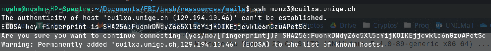

# Cours 02 - SSH [^1] #

## Login ##

	$ ssh login@mon.server.com

MIM attack => Man in the Middle => Qqn qui se met entre nous et la machine  
=> Besoin de s'authentifier ET soi pour se connecter au serveur  
ET aussi authentifier le serveur (que ce à quoi on se connecte soit bien le serveur) i.e. check authenticity.  

=> Se fait via fingerprint.

#### Exo avec `cuilxa.unige.ch` ####

Ici le fingerprint est: `SHA256:FuonkDNdyZ6e5Xl5cYijKOIKEjjcvklc6nGzuAPetSc`

Lors de la connection, le terminal nous demande si l'on veut bien se connecter au serveur dont la clé fingerprint est _displays fingerprint_  
et l'on peut répondre en mettant celle que l'on attend de trouver et le terminal va s'occuper de voir si c'est la même ou non pour nous. i.e. :  

	$ ssh login@mon.serveur.com
		> authenticity of host can't be verified. fingerprint is: <fingerprint> 
		> Are you sure you want to continue connecting (yes/no/[fingerprint])? 

	$ <fingerprint>
		> Added <mon.serveur.com> to list of known host 
		> login@mon.serveur.com's password:

	$ <password>
		> Welcome to Ubuntu 20.04.3 LTS (GNU/Linux 5.4.0-89-generic x86_64) ...
		> ...

<small> Connection to server. (if fingerprint matches)</small>

<!--  -->


<!--  -->


---

## SCP ##

La commande SCP permet de copier des fichier d'un serveur vers la machine locale et vice-versa

	$ scp login@mon.server.com:/path/to/my/file /path/to/destination
	$ scp /path/to/my/file login@mon.server.com:/path/to/destination

Les formats de chemin habituels sont disponibles `(*, ?, ~, etc.)`

#### Exos ####


<small> (on peut copier des dossiers juste mettre `-r`) </small>

==> Modifications en local
	
	echo "Modif en local" >> home_dir_content.txt

==> Push back on server with ssh

	ressources/exo_ssh$ scp ./home_dir_content.txt munz3@cuilxa.unige.ch:~/exo_ssh/
							> munz3@cuilxa.unige.ch's password: 
							> home_dir_content.txt                                                                                         	100%  658    99.1KB/s   00:00
	
	ressources/exo_ssh$ |

Fichier a été uploaded on server. **PAS OUBLIER LE "`:`" ENTRE SERVER & PATH !!**

---

## Authentification par clés RSA  [^2] ##


**Génération de la paire de clé rsa**:

```

~/Documents/FBI/exo_ssh$ ssh-keygen
		
		> Generating public/private rsa key pair.
		> Enter file in which to save the key (/home/noahm/.ssh/id_rsa): ssh_exo3_rsa_key
		> Enter passphrase (empty for no passphrase): 
		> Enter same passphrase again: 

		> Your identification has been saved in ssh_exo3_rsa_key
		> Your public key has been saved in ssh_exo3_rsa_key.pub
		
		> The key fingerprint is:
		> SHA256:O5Go4cs24bg6pqV9rYAIztKU1DZ5mX8X7dFGKBh3+WU noahm@noahm-HP-Spectre
		
		> The key's randomart image is:
+---[RSA 3072]----+
|          .o. .o.|
|   . . o  ...oooE|
|  . = +     ..oo+|
| . o o o .   o o.|
|. o . . S . . .  |
|=+ ..o   + .     |
|+o+ooo  o        |
|o=.o=..  .       |
|*oo++o           |
+----[SHA256]-----+

```

2 files saved :

	@noahm:~/Documents/FBI/exo_ssh$ ls -la

		> total 20
		> drwxrwxr-x 2 noahm noahm 4096 Nov  9 10:55 .
		> drwxrwxr-x 6 noahm noahm 4096 Nov  9 10:42 ..
		> -rw------- 1 noahm noahm 2610 Nov  9 10:55 exo3_rsaKey
		> -rw-r--r-- 1 noahm noahm  576 Nov  9 10:55 exo3_rsaKey.pub
		> -rw-r--r-- 1 noahm noahm  658 Nov  9 10:43 home_dir_content.txt  
  
**Copie de la clé publique sur le serveur:**

	@noahm:~/Documents/FBI/exo_ssh$ ssh-copy-id -i ./exo3_rsaKey.pub munz3@cuilxa.unige.ch
		
		> /usr/bin/ssh-copy-id: INFO: Source of key(s) to be installed: "./exo3_rsaKey.pub"
		
		> /usr/bin/ssh-copy-id: INFO: attempting to log in with the new key(s), to filter out any that are already installed
		> /usr/bin/ssh-copy-id: INFO: 1 key(s) remain to be installed -- if you are prompted now it is to install the new keys
		
		> munz3@cuilxa.unige.ch's password: 


	@noahm:~/Documents/FBI/exo_ssh$ <password>

		> Number of key(s) added: 1
		> Now try logging into the machine, with: "ssh munz3@cuilxa.unige.ch" and check to make sure that only the key(s) you wanted were added.	

**Login:**
	
	noahm@noahm-HP-Spectre:~/Documents/FBI/exo_ssh$ ssh munz3@cuilxa.unige.ch
		> munz3@cuilxa.unige.ch's password: 

		> Welcome to Ubuntu 20.04.3 LTS (GNU/Linux 5.4.0-89-generic x86_64)
		> ...
		> Last login: Tue Nov  9 10:51:46 2021 from 10.20.113.11

	munz3@cuilxa:~$ exit
		> logout
		> Connection to cuilxa.unige.ch closed.

_==> Supposed not to ask for password, how to do it ?_


<br> 
<br>
<!-- --------------------------------------------------------------------------- -->

[^1]: [Connexion à distance: SSH](https://cui.unige.ch/~chanel/prez/presentations/outils-info/shell/#/9)
[^2]: [SCP-Auth_par_clé_publique](https://cui.unige.ch/~chanel/prez/presentations/outils-info/shell/#/9/6)