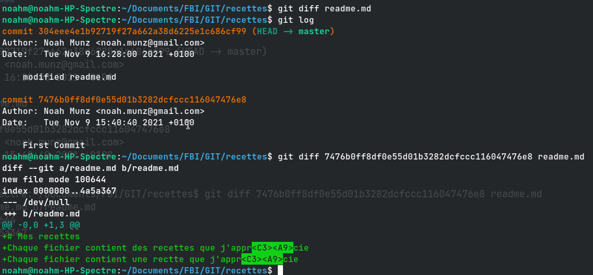

# Cours 03 - GIT [^1] #

## Resources ##

NOUS NE VOUS DISONS PAS TOUT...  
Le livre en ligne git est extrêmement bien fait et vous apprendra tout ce que nous n'avons pas le temps de vous montrer:  

| Website					| Livre - PDF 	 |
|---------------------------|----------------|
|https://git-scm.com/book   |  [Pro-Git](file:///home/noahm/Documents/progit.pdf) |

Un tutoriel plus rapide:  

https://www.atlassian.com/git/tutorials  

Un guide intéressant:  

https://hacker-tools.github.io/version-control  

Un petit jeu si vous vous ennuyez pendant ce cours ou plus tard:  

https://learngitbranching.js.org  

---

 

## Config [^2] ##

Username, user-email, editor (vim etc...), color-highliting etc...

Check configs:
	
	git config --list (--global)

https://www.atlassian.com/git/tutorials/setting-up-a-repository/git-config

|Editor	     |config command|
-------------|--------------|
Atom	     | git config --global core.editor "atom --wait"
emacs	     | git config --global core.editor "emacs"
nano	     | git config --global core.editor "nano -w"
vim	         | r
Sublime Text (Win, 64-bit install) |	 git config --global core.editor "'c:/program files/sublime text 3/sublimetext.exe' -w"
Textmate	| git config --global core.editor "mate -w"	

	$ git config --global color.ui true

 

---

 

## Intro to repos [^3] ##

Commandes de base  (init, add, commit)

==> `Stage` = ajouter à l'index (staged for commit, avant de apply les changements au repo local i.e. avant de commit)

 

#### Exos - 1er Répo (dépôt): ####

"_Ajoutez au dépôt un fichier recette contenant une recette de votre choix_" ==> i.e. add & commit 

	git add [fichier]
	git commit [fichier]

`HEAD` : Où on est dernièrement ==> __*Dernier*__ commit

Tips pour déterminer le char encoding et type d'un fichier :
	
	$ file -bi sandwich.txt 
		> text/plain; charset=utf-8

---

 

## Check diffs [^4] ##

	git log, diff, diff [commit-hash] [fileName], git diff [old-hash] [recent-hash] [fileName]

#### Exos - diffs: ####

---

Supprimer tous les changements du working tree pour revenir à l'état du dernier commit:

	$ git checkout -- [fileName]

(did nothing why?)

 - "J'ai ajouté un fichier de trop dans l'index (staging area) et je ne le veux pas dans le commit"

	`$ git reset filename`

 - "Zut... j'ai fait trop de changements dans mon fichier et je voudrais les insérer en plusieurs commit"
	
	`$ git add -p; git commit`
	(option s pour séparer, parfois marche pas veut pas)

#### Exo Correct working tree ####

inserer photos exo3

#### Exo corriger les commits [^5] ####

**Revert / change commit**

inser photo 1 a 5

**Remove / Rename filse**

	git mv = mv + git add

added fondue => commit.  
copied fondue into fondue2 => git add fondue2.  
rm fondue.txt  (without adding the removal of fondue)  

=> git status 
		
	On branch master
		Changes to be committed:
  		(use "git restore --staged <file>..." to unstage)
	        new file:   fondue2.txt

	    Changes not staged for commit:
  			(use "git add/rm <file>..." to update what will be committed)
  			(use "git restore <file>..." to discard changes in working directory)
        	deleted:    fondue.txt

normal
	
	git rm fondue.txt 

will rm fondue and git add it but file is not there  
git status

	On branch master
	Changes to be committed:
  		(use "git restore --staged <file>..." to unstage)
        	renamed:    fondue.txt -> fondue2.txt

file was renamed ? git understands that we just renamed the file 

	$ ls
		> fondue2.txt  readme.md  sandwich.txt

	recettes$ git mv fondue2.txt fondue.txt
	recettes$ git status
		> On branch master
		> nothing to commit, working tree clean

Rename the filed to fondue.txt and staged the changed (i.e. went back to before)

  
 
<!--- --------------------------------------------------------------------------- --->

[^1]: [GIT](https://cui.unige.ch/~chanel/prez/presentations/outils-info/git/#/)
[^2]: [Config](https://cui.unige.ch/~chanel/prez/presentations/outils-info/git/#/2/2)
[^3]: [Intro-Repo](https://cui.unige.ch/~chanel/prez/presentations/outils-info/git/#/3)
[^4]: [Diffs-Diferentiate_Commits_by_file](https://cui.unige.ch/~chanel/prez/presentations/outils-info/git/#/3/4/2)
[^5]: [Enoncé](https://cui.unige.ch/~chanel/prez/presentations/outils-info/git/#/3/8)