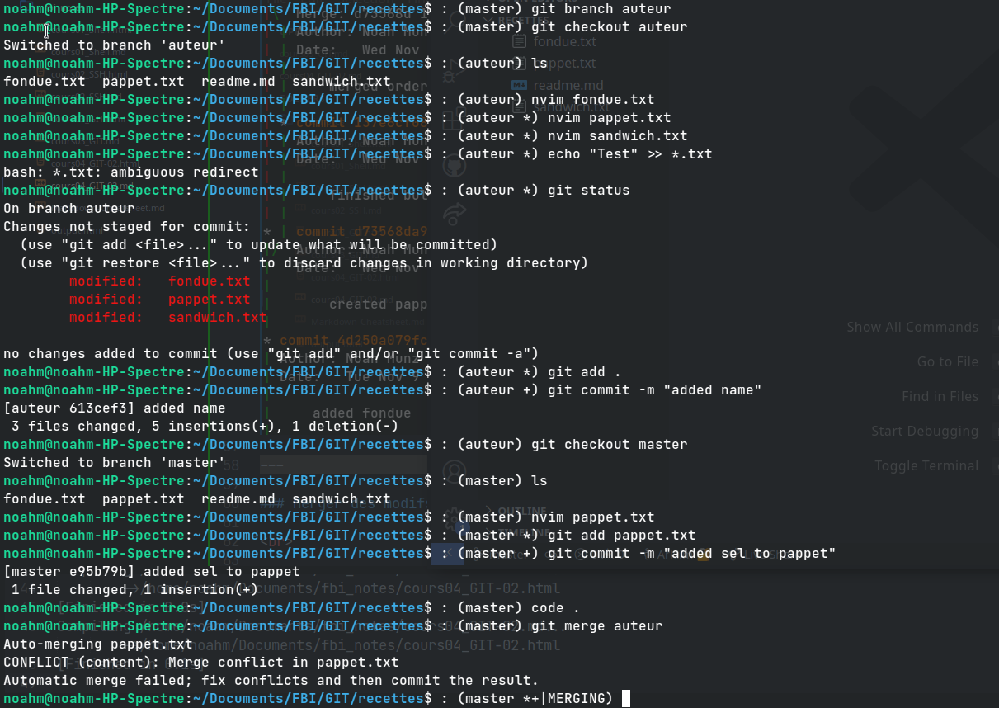
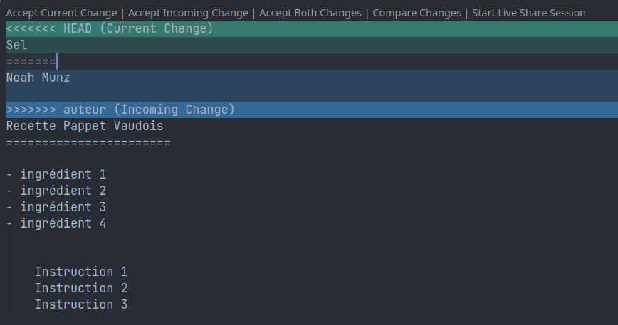
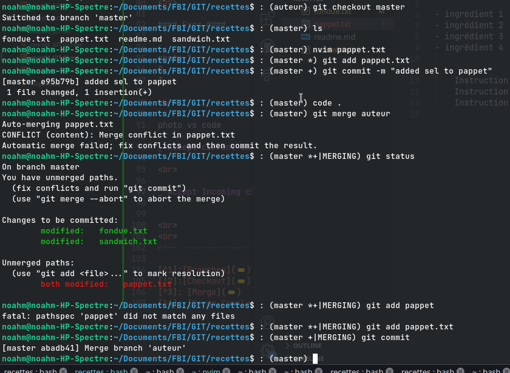
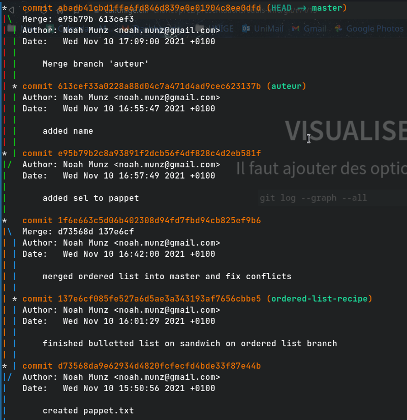
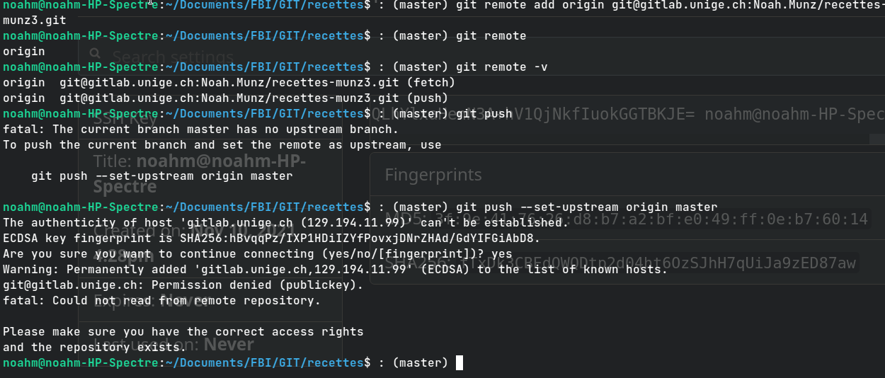

# Cours 04 - GIT 02 - Branches & Merges [^1] #

### Notes ###

==> `HEAD` dépend du commit pas des modifs/add 	

==> `pull` = `fetch` + `merge`

### Exos Branches ###

=> modif puis checkout sans git add, discard pas complètement, fichier existe mais "pas sur une seule branche" c'est **seulement quand** on va
**commit**
que le _"fichier avec les modifs"_ seront ajoutés uniquement **sur** la **branche où** il a été **commit**


==> Branche dans le directory est lien vers le dernier commit de cette branche ==> comme pointer en C 

<br>


  
==> Added ordered-list in sandwich.txt on branch `ordered-list-recipe` (and git add)

==> Checked out on branch `Master` (without committing) 

  

And on master ==> added new file pappet.txt. (git add)

So now as `staged changes` (dans l'index) we have :

1. ol in sandwich.txt on branch `ordered-list-recipe`
2. added pappet.txt on branch `master`

> 

	git commit -m "created pappet.txt"

==> Commit on master ==> Branch diverged.

<br>

Weird fact : we changed sandwich.txt and git added it on branch **ol-recipe**, 
and yet `git status` on **master** tells us that it was modified & added and that we have to commit it even though, _the 
changes didn't occur on this branch_.


It's even worse than that. Since we committed the changes on branch master, the __changement we made__ in the working directory on branch 
`ordered-list-recipe` __*moved to master*__.  

I.e. the modif was _"confirmed"_ in `master` and "_disappeared_" in `ordered-list-recipe` (reverted back to its old state).

This was the content of the file before: (on ol-recipe)

	- ingrédient 1
	- ingrédient 2
	- ingrédient 3

	- cuisson 3 minutes

After :
	
	1 ingrédient 1
	2 ingrédient 2
	3 ingrédient 3

	- cuisson 3 minutes

Now git add... :

	git add sandwich.txt
	git checkout master
	nvim pappet.txt
	git add pappet.txt
	git commit -m "created pappet.txt"

	git checkout ordered-list-recipe

And this is the "_new_" content of `sandwich.txt` on `ordered-list-recipe`:

	


changes were **_transferred_** / **_assigned to_** branch **`master`**.

<br>

 

Graph de comment la branche ordered-list-recipe a divergé de master.


_Check "à quoi a été link" le head_ i.e. ce qu'il y a dans `(HEAD -> [Nom de Branch])`,

message après le commit hash: `* commit d73568da9e62934d4820fcfecfd4bde33f87e44b  ==> (master) <==`

<br>

---

<br>

#### Plus d'exemples: ####

Additional exemples on "modifs that moved with commits" :


Switched from ordered-list to unordered-list on branch `ul-recipe`.  
then committed the change on `master`.  
Then the `master` took the modifications and `ul-recipe` was reverted back to its old state.  

<br>

(`*** See below`)

<br>

---

<br>

## Checkout plus d'infos [^2] ##

<br>

---

<br>

## Git Merge [^3] ##

<br>

#### Merge - Exo ####


<br>


Dans nvim: (Plus de détail sur comment ça marche dans la partie 04)

	<<<<<<< HEAD
	1 ingrédient 1
	2 ingrédient 2
	3 ingrédient 3
	=======
	- ingrédient 1
	- ingrédient 2
	- ingrédient 3
	>>>>>>> 

	- cuisson 3 minutes

Conflits ont été fix via nvim, merge peut se conclure.

<br>


On voit que la branche `ordered-list-recipe` à rejoint la branche master et les 2 convergent vers le même point.

<br>

---

<br>

### Merger des modifs Complexes [^4] ###

C'est le `=======` qui indique les différentes versions / différences du fichier ainsi que les conflits.  

```Sh
<<<<<<< HEAD
Sel
======= # <== indique fin de la version du fichier qu'il y avait dans le He sur master avant
Noah Munz

>>>>>>> auteur # <== indique la branche qu'on a merge qui a provoqué les conflits
Recette Pappet Vaudois
======================= 

- ingrédient 1
- ingrédient 2
- ingrédient 3
- ingrédient 4
```

<br>

#### Exos ####






<br>

_"Accept current changes"_ veut dire ==> accepter la version du `HEAD` et discard le reste (current <=> HEAD)  

_"Accept Incoming changes"_ veut dire ==> accepter les changements qui viennent (i.e. pas là où on est, pas le `HEAD`)

---

 ==> Resolved




<br>



_Graph résumé de la résolution des 2 merges & divergences en entier._


---

<br>

## Remote [^5] ##
 
 Push, Pull request, clone, Fork, Git Workflow etc... 

 ==> Pour pouvoir pull/push en secure il faut le faire ssh.

<br>

### Connexion à GitLab / Serveur CUI via SSH [^6] ###


<br>


<br>


---

#### Création d'un Repo ####

Create repo, un peu comme sur github mais en passant par SSH:

	Clone WITH SSH !!

==> `add remote` :



`Permission denied` ! ==> Quand on réessaye en renommant les clés avec leurs noms par défaut, ca marche

==> **_PAS MODIFIER LE NOM DE LA CLÉ SSH !!_**	

<br>


Then:

	noahm@noahm-HP-Spectre:~/Documents/FBI/GIT/recettes$ : (master) git status
		> On branch master
		> Your branch is up to date with 'origin/master'.

		> nothing to commit, working tree clean
	noahm@noahm-HP-Spectre:~/Documents/FBI/GIT/recettes$ : (master)

<br>

---

# Cours 05 - GIT - Fork [^7] #

En ayant déjà clické sur `fork` sur gitlab ==> Repo qu'on fork est déjà configuré donc on a juste plus qu'à le `clone` (ssh).

En effet, après avoir fait:

	git clone git@gitlab.unige.ch:Noah.Munz/recette-adrien_d.git

==> Tentative de `remote add origin` mais git nous dit que c'est déjà configuré.


<br>

<br>

<!-- --------------------------------------- -->

[^1]: [Branches](https://cui.unige.ch/~chanel/prez/presentations/outils-info/git/#/4/1)
[^2]: [Checkout](https://cui.unige.ch/~chanel/prez/presentations/outils-info/git/#/4/7)
[^3]: [Merge](https://cui.unige.ch/~chanel/prez/presentations/outils-info/git/#/4/10)
[^4]: [Merge-Complexe](https://cui.unige.ch/~chanel/prez/presentations/outils-info/git/#/4/12)
[^5]: [Remote](https://cui.unige.ch/~chanel/prez/presentations/outils-info/git/#/5)
[^6]: [GitLab-SSH](https://cui.unige.ch/~chanel/prez/presentations/outils-info/git/#/5/2)
[^7]: [Fork](https://cui.unige.ch/~chanel/prez/presentations/outils-info/git/#/5/4)

---

<br>
<br>

---

<br>

<br>

<br>

(`***`) 

### Further Testing ###
_Partie pas "fact-checked" par prof._

--

Quand on est allé sur branch ul-recipe pour voir que les diffs ont yeet vers master quand on a commit dessus.  
=> git status donne:

	~/Documents/FBI/GIT/recettes$ : (ul-recipe) git status
		> On branch ul-recipe
		> nothing to commit, working tree clean

Says clean but when checked out on master again

	~/Documents/FBI/GIT/recettes$ : (ul-recipe) git checkout
	~/Documents/FBI/GIT/recettes$ : (ul-recipe) git checkout master 
		
		> Switched to branch 'master'
		> Your branch is ahead of 'origin/master' by 1 commit.
  		> (use "git push" to publish your local commits)

Need to push ?? Is it because of misstype ? ==> because entered `git checkout` sans rien derrière ?  

Non local rep a été modifié (on a commit) et on pas encore push donc on est juste en avance sur la remote c'est tout.

--

	noahm@noahm-HP-Spectre:~/Documents/FBI/GIT/recettes$ : (master) git merge ul-recipe 
		Already up to date.

Alors que content of sandiwch in master is:

	noahm@noahm-HP-Spectre:~/Documents/FBI/GIT/recettes$ : (master) cat sandwich.txt 
		Noah Munz

		// COMME ON A COMMIT SUR MASTER, SANDWICH.TXT SUR BRANCH 
		ORDERED-LIST A DIVERGÉ ET A PAS PRIS LES CHANGEMENTS !

		- ingrédient 1
		- ingrédient 2
		- ingrédient 3

		- cuisson 3 minutes

And sandwich in ul-recipe is:

	noahm@noahm-HP-Spectre:~/Documents/FBI/GIT/recettes$ : (ul-recipe) cat sandwich.txt 
		Noah Munz

		// COMME ON A COMMIT SUR MASTER, SANDWICH.TXT SUR BRANCH 
		ORDERED-LIST A DIVERGÉ ET A PAS PRIS LES CHANGEMENTS !

		1 ingrédient 1
		2 ingrédient 2
		3 ingrédient 3

		- cuisson 3 minutes

Pourquoi on peut pas merge ul-recipe dans master ?

==> HEAD a pas bougé :


#### ORIGIN <=> REMOTE, just push! ####

try `checkout origin/master` and not `just master`
and : 


origin/master était bien au stad d'avant. On est maintenant en detached (`HEAD` est plus à la fin)


--

<br>


Just by doing 

	ul-recipe ==> master ==> "origin/master ?" ==> master 

`HEAD` moved (now at commit  "test to see..."), why ?

_Hypothèse:_ maintenant on peut merge.
 
==> Nope.

Car il considère que la version avec les tirets est la plus récente et que "la branche a déjà été merge" i.e. 
que le purpose de la création de la branche a été fulfilled.

<br>

---

<br>

<br>

<br>

